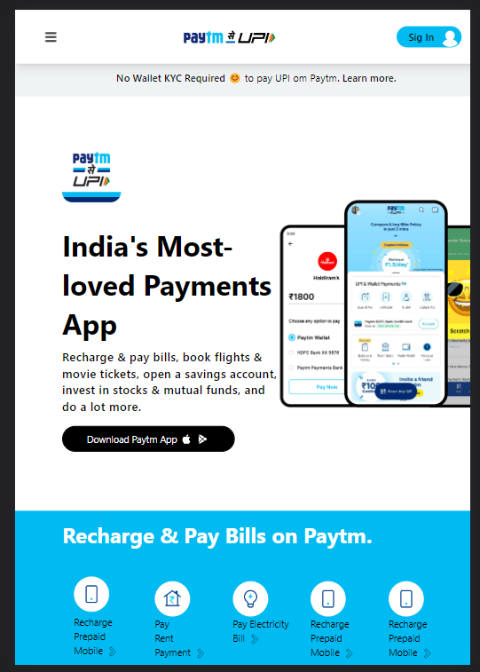
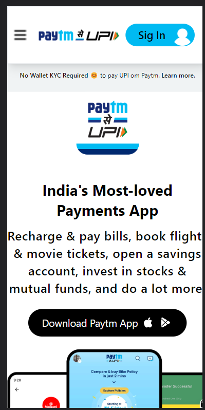

# Cryto Landing Page
> Project -5 Design by **Abhishek Bhuyan**

<table>
      <th>
        <tr>Aim</tr>
      </th>
      <tbody>
        <td> To build a Static landing page Purly using HTML & CSS</td>
      </tbody>
</table>

### Learning outcome
- creating Navbar using Css flexbox and the different propertise of flexbox.
- Tag and attruibute based selection of HTML   elements
- Able to understand grid for constructing main content.
- Able to desgin button stying.
- Able understand How to add Extra layer color on background img.

### Device Support
 This static page is compatible with **All screen only**

### Project View
- Large Screen

- Medium Screen
  

- Small Screen 

### Demo

### Autor

### Contact
- [LinkedIn](https://www.linkedin.com/in/abhisekh-bhuyan-5605b3230/ )

- 
